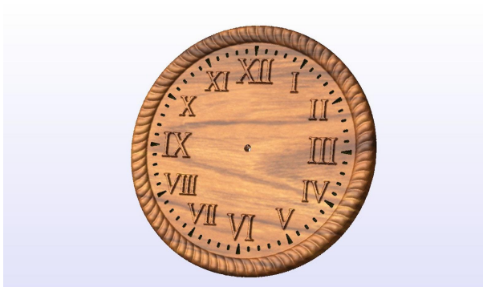
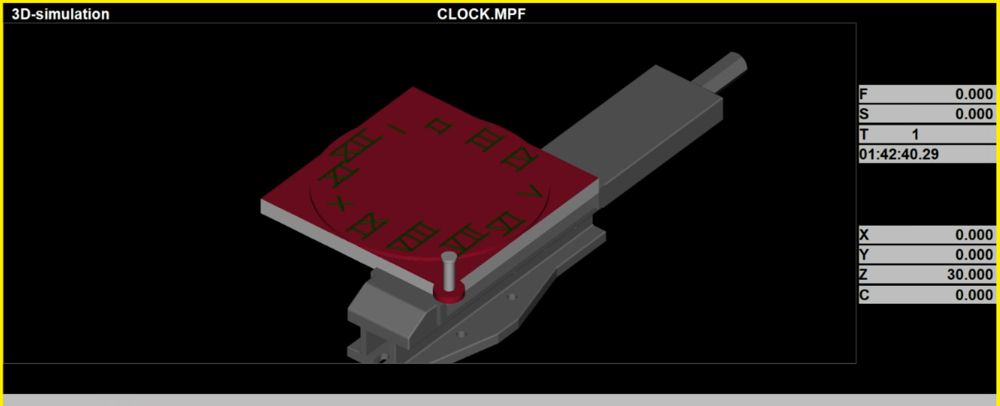
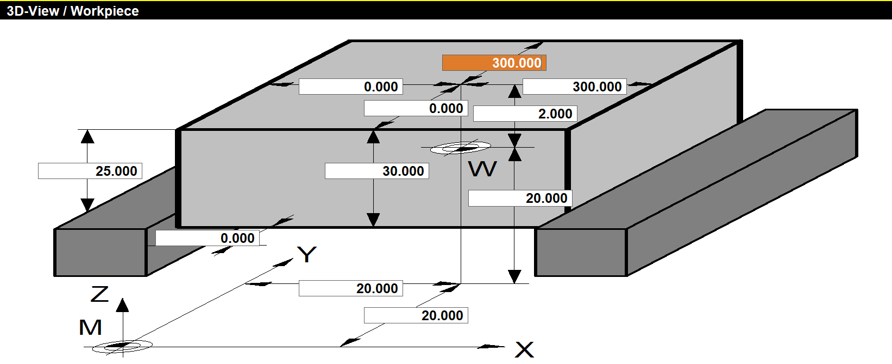
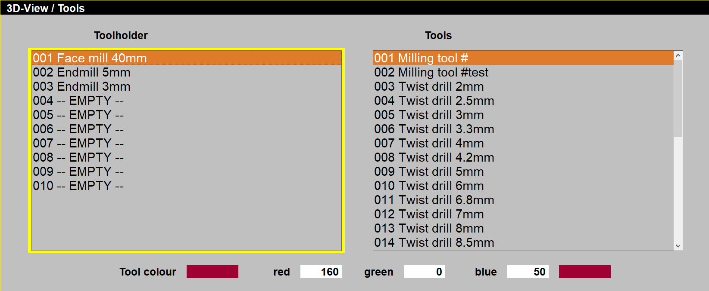

# CNC Roman Clock Simulation using winNC

  
  

## Project Specifications

### Workpiece Configuration

| Parameter | Value |
|-----------|-------|
| Material | Aluminum 6061-T6 |
| Diameter | 600mm |
| Thickness | 30mm |
| Stock Allowance | 2mm (all surfaces) |
| Work Zero Offsets | X+20mm, Y+20mm, Z+20mm |

## Tooling & Machining Strategy

### Tool Table
| Tool | Type | Diameter | Flutes | Application | Offset Register |
|------|------|----------|--------|-------------|-----------------|
| T1 | Facemill | 40mm | 6 | Surface milling | G54.1 P1 |
| T2 | Endmill | 5mm | 4 | Roughing numerals | G54.1 P2 |
| T3 | Endmill | 3mm | 2 | Finishing details | G54.1 P3 |

## How To Run
1.  Open CLOCK.MPF file using a cnc software like WinNC
2.  Adjust the offsets in the software according to offsets.PNG file
3.  Run the program and see the finished product which is Roman Clock
